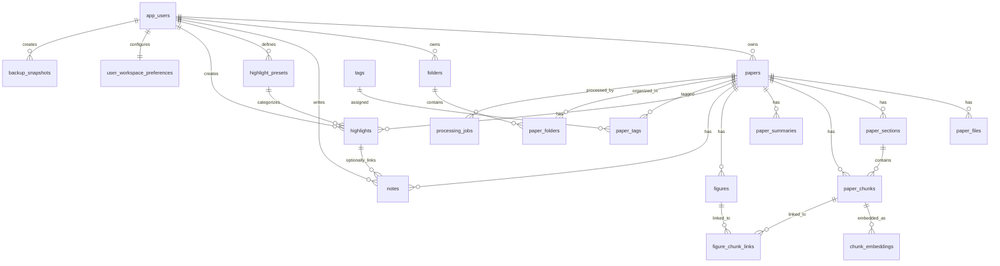

# Database Schema Draft

이 문서는 `local Supabase(PostgreSQL)`를 기준으로 한 데이터베이스 초안이다.  
목표는 지금 바로 SQL을 확정하는 것이 아니라, **MVP에서 필요한 테이블과 관계를 먼저 정리하는 것**이다.

전제:
- 앱은 Windows 데스크톱 앱이다.
- PDF 원본 파일과 figure 이미지 파일은 로컬 디스크에 저장한다.
- DB에는 파일 자체가 아니라 `경로`, `메타데이터`, `구조화된 텍스트`, `annotation`, `상태 정보`를 저장한다.
- MVP는 개인 사용 중심이지만, 향후 팀 공유 가능성을 고려해 `user_id` 구조는 남겨둔다.
- 자동 추출 데이터와 사용자 작성 데이터는 가능하면 분리해서 저장한다.

---

## 1. 설계 원칙

### 1-1. `paper`와 `file`을 분리한다

논문은 하나의 개념 객체이고, 실제 파일은 그 논문에 연결된 자원이다.

예:
- 메인 PDF
- supplementary PDF
- 추출된 figure 이미지

따라서 `papers`와 `paper_files`는 분리하는 것이 맞다.

### 1-2. 구조화 본문은 `section`과 `chunk`로 나눈다

RAG, provenance, 근거 검색을 위해 아래 계층이 필요하다.

- paper
- section
- chunk

### 1-3. annotation은 별도 테이블로 분리한다

하이라이트와 메모는 단순 UI 정보가 아니라, 나중에 검색과 retrieval signal로도 쓰인다.  
따라서 `notes`, `highlight_presets`, `highlights`를 별도 테이블로 둔다.

### 1-4. LLM 요약은 메타데이터와 분리한다

제목, DOI, 저널 같은 기본 메타데이터와  
한 줄 요약, 목적, 방법, 결과, 한계점 같은 분석 필드는 성격이 다르다.

따라서 `paper_summaries` 같은 테이블로 분리하는 편이 안전하다.

---

## 2. 전체 관계 개요

---

## 3. MVP 핵심 테이블

### 3-1. `app_users`

목적:
- Supabase `auth.users`와 연결되는 앱 프로필 테이블
- 사용자별 preset, note, highlight, workspace 설정을 분리하기 위한 최소 사용자 테이블

추천 컬럼:

| 컬럼 | 타입 | 설명 |
|---|---|---|
| id | uuid pk | 사용자 ID |
| display_name | text | 표시 이름 |
| email | text nullable | auth 연동 이메일 |
| auth_provider | text nullable | `email`, `google` 등 |
| role | text | `owner`, `member` 등 |
| created_at | timestamptz | 생성 시각 |
| updated_at | timestamptz | 수정 시각 |

비고:
- 실제 인증은 Supabase auth를 사용하고, `app_users.id`는 `auth.users.id`를 참조하는 구조가 적절하다.
- 기본 인증은 이메일/비밀번호 계정 생성, 소셜 로그인은 Google 로그인 지원으로 시작하는 것이 맞다.

### 3-2. `papers`

목적:
- 논문의 기본 메타데이터와 앱 내 상태를 저장

추천 컬럼:

| 컬럼 | 타입 | 설명 |
|---|---|---|
| id | uuid pk | paper ID |
| owner_user_id | uuid fk | 소유 사용자 |
| title | text | 논문 제목 |
| normalized_title | text | 검색/중복 비교용 정규화 제목 |
| publication_year | int nullable | 연도 |
| journal_name | text nullable | 저널/학회명 |
| doi | text nullable | DOI |
| abstract | text nullable | 초록 |
| language | text | 기본 `en` |
| reading_status | text | `unread`, `reading`, `read`, `archived` |
| is_important | boolean | 중요 논문 여부 |
| should_revisit | boolean | 다시 볼 논문 여부 |
| publication_type | text nullable | journal, conference, preprint 등 |
| metadata_confidence | numeric nullable | 메타데이터 추출 신뢰도 |
| trashed_at | timestamptz nullable | 휴지통 이동 시각 |
| trashed_by_user_id | uuid fk nullable | 휴지통 이동 사용자 |
| created_at | timestamptz | 생성 시각 |
| updated_at | timestamptz | 수정 시각 |

추천 제약:
- `doi`는 partial unique index 고려
- `reading_status`는 enum 또는 check constraint 권장

비고:
- 삭제는 즉시 hard delete가 아니라 `trashed_at` 기반 soft delete로 처리하고, 휴지통에서 다시 삭제할 때 완전 삭제하는 정책이 맞다.

### 3-3. `paper_files`

목적:
- 논문과 연결된 실제 파일 정보를 관리

추천 컬럼:

| 컬럼 | 타입 | 설명 |
|---|---|---|
| id | uuid pk | 파일 ID |
| paper_id | uuid fk | 연결된 논문 |
| file_kind | text | `main_pdf`, `supplementary_pdf`, `figure_asset` |
| original_filename | text | 원본 파일명 |
| stored_filename | text | 앱 내부 저장 파일명 |
| stored_path | text | 로컬 저장 경로 |
| checksum_sha256 | text nullable | 중복 비교용 |
| file_size_bytes | bigint nullable | 파일 크기 |
| mime_type | text nullable | 파일 형식 |
| is_primary | boolean | 메인 파일 여부 |
| created_at | timestamptz | 생성 시각 |

비고:
- 실제 파일은 디스크에 있고, DB는 참조만 가진다.
- paper가 휴지통에 들어가면 연결된 파일도 즉시 삭제하지 않고 복원 가능 상태로 유지한다.

### 3-4. `paper_sections`

목적:
- 논문 본문을 섹션 단위로 저장

추천 컬럼:

| 컬럼 | 타입 | 설명 |
|---|---|---|
| id | uuid pk | section ID |
| paper_id | uuid fk | 연결된 논문 |
| section_name | text | `Abstract`, `Methods`, `Results` 등 |
| section_order | int | 섹션 순서 |
| page_start | int nullable | 시작 페이지 |
| page_end | int nullable | 끝 페이지 |
| raw_text | text | 섹션 전체 텍스트 |
| parser_confidence | numeric nullable | 파싱 신뢰도 |
| created_at | timestamptz | 생성 시각 |

추천 규칙:
- `References`와 `Appendix`도 별도 섹션으로 저장 가능

### 3-5. `paper_chunks`

목적:
- 검색, RAG, provenance를 위한 chunk 단위 저장

추천 컬럼:

| 컬럼 | 타입 | 설명 |
|---|---|---|
| id | uuid pk | chunk ID |
| paper_id | uuid fk | 연결된 논문 |
| section_id | uuid fk nullable | 연결된 섹션 |
| chunk_order | int | paper 내 순서 |
| page | int nullable | 대표 페이지 |
| text | text | chunk 본문 |
| token_count | int nullable | 토큰 수 |
| start_char_offset | int nullable | 원문 기준 시작 위치 |
| end_char_offset | int nullable | 원문 기준 끝 위치 |
| parser_confidence | numeric nullable | 분할 신뢰도 |
| created_at | timestamptz | 생성 시각 |

추천 인덱스:
- `(paper_id, chunk_order)`
- `(paper_id, page)`

### 3-6. `chunk_embeddings`

목적:
- retrieval-ready 상태를 만들기 위한 chunk vector 저장
- 자동 요약은 이 단계 이후에 실행하는 정책을 반영

추천 컬럼:

| 컬럼 | 타입 | 설명 |
|---|---|---|
| chunk_id | uuid pk fk | 연결된 chunk |
| embedding | vector nullable | 임베딩 벡터 |
| embedding_model | text | 사용 모델명 |
| embedding_dim | int nullable | 차원 수 |
| created_at | timestamptz | 생성 시각 |

비고:
- semantic search를 바로 노출하지 않더라도, vector 생성 자체는 초기 파이프라인에 포함될 수 있다.

### 3-7. `paper_summaries`

목적:
- LLM 또는 사용자가 정리한 분석/요약 필드 저장

추천 컬럼:

| 컬럼 | 타입 | 설명 |
|---|---|---|
| id | uuid pk | summary ID |
| paper_id | uuid fk | 연결된 논문 |
| version_no | int | 요약 버전 |
| source_type | text | `llm`, `user`, `system` |
| is_current | boolean | 현재 활성 요약 여부 |
| one_line_summary | text nullable | 한 줄 요약 |
| objective | text nullable | 핵심 목적 |
| method_summary | text nullable | 핵심 방법 |
| main_results | text nullable | 주요 결과 |
| limitations | text nullable | 한계점 |
| conditions_summary | text nullable | 실험 조건 요약 |
| created_by_user_id | uuid fk nullable | 사용자가 수동 저장한 경우 |
| created_at | timestamptz | 생성 시각 |
| updated_at | timestamptz | 수정 시각 |

비고:
- UI의 논문 카드는 `papers + paper_summaries + notes` 조합으로 만들어진다.

### 3-8. `figures`

목적:
- figure와 caption, figure 관련 상태 저장

추천 컬럼:

| 컬럼 | 타입 | 설명 |
|---|---|---|
| id | uuid pk | figure ID |
| paper_id | uuid fk | 연결된 논문 |
| source_file_id | uuid fk nullable | 원본 파일 참조 |
| figure_no | text | `Figure 1`, `Fig. 2` 등 |
| caption | text nullable | caption |
| page | int nullable | figure가 있는 페이지 |
| image_path | text nullable | 로컬 이미지 경로 |
| summary_text | text nullable | figure 설명 요약 |
| is_key_figure | boolean | 핵심 figure 여부 |
| is_presentation_candidate | boolean | 발표 후보 여부 |
| created_at | timestamptz | 생성 시각 |

### 3-9. `figure_chunk_links`

목적:
- figure와 관련 본문 chunk 연결

추천 컬럼:

| 컬럼 | 타입 | 설명 |
|---|---|---|
| figure_id | uuid fk | figure |
| chunk_id | uuid fk | 연결된 chunk |
| link_type | text | `caption_context`, `mentions_figure`, `describes_result` |
| created_at | timestamptz | 생성 시각 |

추천 제약:
- `(figure_id, chunk_id)` unique

### 3-10. `folders`

목적:
- 사용자가 프로그램 내부에서 논문을 직접 구조화하는 논리 폴더
- 실제 디스크 저장 경로와는 별개

추천 컬럼:

| 컬럼 | 타입 | 설명 |
|---|---|---|
| id | uuid pk | folder ID |
| owner_user_id | uuid fk | 폴더 소유 사용자 |
| parent_folder_id | uuid fk nullable | 상위 폴더 |
| name | text | 폴더 이름 |
| slug | text nullable | 정규화 식별자 |
| color_hex | text nullable | 선택 색상 |
| sort_order | int nullable | 정렬 순서 |
| is_system | boolean | 시스템 폴더 여부 |
| created_at | timestamptz | 생성 시각 |
| updated_at | timestamptz | 수정 시각 |

비고:
- 폴더는 트리 구조를 허용하는 편이 좋다.
- 예: `발표준비/PSA`, `리뷰예정/CO2`, `내논문근거`

### 3-11. `paper_folders`

목적:
- 논문과 폴더의 다대다 연결

추천 컬럼:

| 컬럼 | 타입 | 설명 |
|---|---|---|
| paper_id | uuid fk | 논문 |
| folder_id | uuid fk | 폴더 |
| assigned_by_user_id | uuid fk nullable | 누가 넣었는지 |
| created_at | timestamptz | 생성 시각 |

추천 제약:
- `(paper_id, folder_id)` unique

비고:
- 하나의 논문이 여러 폴더에 들어갈 수 있게 하면 사용성이 좋다.

### 3-12. `tags`

목적:
- 논문/메모/향후 ontology seed용 태그 정의

추천 컬럼:

| 컬럼 | 타입 | 설명 |
|---|---|---|
| id | uuid pk | tag ID |
| owner_user_id | uuid fk nullable | 사용자 태그면 user 연결 |
| name | text | 태그 이름 |
| slug | text | 정규화된 식별자 |
| tag_type | text nullable | material, phenomenon, variable 등 |
| is_system | boolean | 시스템 기본 태그 여부 |
| created_at | timestamptz | 생성 시각 |

### 3-13. `paper_tags`

목적:
- 논문과 태그의 다대다 연결

추천 컬럼:

| 컬럼 | 타입 | 설명 |
|---|---|---|
| paper_id | uuid fk | 논문 |
| tag_id | uuid fk | 태그 |
| assigned_by_user_id | uuid fk nullable | 누가 붙였는지 |
| created_at | timestamptz | 생성 시각 |

추천 제약:
- `(paper_id, tag_id)` unique

### 3-14. `user_workspace_preferences`

목적:
- 프론트엔드 레이아웃 상태 저장
- 패널 on/off, detached window 여부, 마지막 작업 화면 등을 복원하기 위한 설정

추천 컬럼:

| 컬럼 | 타입 | 설명 |
|---|---|---|
| user_id | uuid pk fk | 사용자 |
| layout_name | text nullable | 현재 레이아웃 이름 |
| left_panel_visible | boolean | 왼쪽 패널 표시 여부 |
| right_panel_visible | boolean | 오른쪽 패널 표시 여부 |
| notes_panel_detached | boolean | 메모 패널 분리 여부 |
| pdf_panel_detached | boolean | PDF 패널 분리 여부 |
| figures_panel_detached | boolean | figure 패널 분리 여부 |
| last_selected_tab | text nullable | 마지막 상세 탭 |
| layout_payload | jsonb nullable | 추가 레이아웃 정보 |
| updated_at | timestamptz | 수정 시각 |

비고:
- 이 테이블은 MVP 필수는 아니지만, `도킹 가능한 3패널` 요구사항을 반영하려면 매우 유용하다.
- 단일 디바이스 앱이면 Electron local store로 시작하고, 이후 필요 시 DB로 옮겨도 된다.

### 3-15. `backup_snapshots`

목적:
- 자동 백업 파일의 생성 이력과 상태를 추적
- 30분 간격 백업과 import 가능한 workspace package 정책을 지원

추천 컬럼:

| 컬럼 | 타입 | 설명 |
|---|---|---|
| id | uuid pk | backup ID |
| user_id | uuid fk | 백업 생성 사용자 |
| backup_path | text | 백업 파일 경로 |
| backup_kind | text | `full_workspace`, `metadata_only` 등 |
| checksum_sha256 | text nullable | 무결성 확인용 |
| file_size_bytes | bigint nullable | 백업 파일 크기 |
| status | text | `created`, `failed`, `imported` |
| created_at | timestamptz | 생성 시각 |

비고:
- 실제 백업 생성은 앱 레벨 작업이지만, 이력을 남기면 UI와 복구 흐름을 만들기 쉽다.
- 다른 사용자의 설치 환경에 import해도 동일하게 복원 가능한 package를 목표로 한다.

---

## 4. Annotation 관련 테이블

### 4-1. `highlight_presets`

목적:
- 하이라이트 카테고리 정의
- `색 = 의미`가 아니라 `카테고리 = 의미`, `색 = 표현` 구조를 담는 테이블

추천 컬럼:

| 컬럼 | 타입 | 설명 |
|---|---|---|
| id | uuid pk | preset ID |
| user_id | uuid fk | 사용자 |
| name | text | 예: 중요 결과 |
| color_hex | text | 예: `#FACC15` |
| description | text nullable | 카테고리 설명 |
| is_system_default | boolean | 기본 카테고리 여부 |
| is_active | boolean | 사용 여부 |
| sort_order | int | 표시 순서 |
| created_at | timestamptz | 생성 시각 |

기본 preset 예시:
- 중요 결과
- 다시 볼 내용
- 내 연구와 관련
- 방법 참고
- 발표 후보
- 의문점
- 주의/한계

### 4-2. `highlights`

목적:
- 실제 PDF 본문에 칠한 하이라이트 저장

추천 컬럼:

| 컬럼 | 타입 | 설명 |
|---|---|---|
| id | uuid pk | highlight ID |
| paper_id | uuid fk | 논문 |
| user_id | uuid fk | 사용자 |
| preset_id | uuid fk | 하이라이트 카테고리 |
| section_id | uuid fk nullable | 연결된 섹션 |
| chunk_id | uuid fk nullable | 연결된 chunk |
| page | int nullable | 페이지 |
| selected_text | text | 사용자가 선택한 텍스트 |
| start_anchor | jsonb nullable | 시작 위치 anchor |
| end_anchor | jsonb nullable | 끝 위치 anchor |
| created_at | timestamptz | 생성 시각 |
| updated_at | timestamptz | 수정 시각 |

핵심:
- `selected_text + page + chunk_id`를 같이 저장하는 것이 좋다.
- PDF 렌더링 로직이 조금 바뀌어도 위치 복구에 도움이 된다.

### 4-3. `notes`

목적:
- paper/section/chunk/figure/highlight에 연결되는 메모 저장

추천 컬럼:

| 컬럼 | 타입 | 설명 |
|---|---|---|
| id | uuid pk | note ID |
| paper_id | uuid fk | 논문 |
| user_id | uuid fk | 작성 사용자 |
| note_scope | text | `paper`, `section`, `chunk`, `figure`, `highlight` |
| section_id | uuid fk nullable | 연결된 섹션 |
| chunk_id | uuid fk nullable | 연결된 chunk |
| figure_id | uuid fk nullable | 연결된 figure |
| highlight_id | uuid fk nullable | 연결된 highlight |
| page | int nullable | 페이지 |
| selected_text | text nullable | 선택된 텍스트 일부 |
| note_type | text | `summary_note`, `question_note` 등 |
| title | text nullable | 짧은 제목 |
| note_text | text | 메모 내용 |
| is_pinned | boolean | 고정 여부 |
| created_at | timestamptz | 생성 시각 |
| updated_at | timestamptz | 수정 시각 |

비고:
- 하이라이트와 메모는 1:1 강제가 아니라 느슨하게 연결하는 편이 좋다.

---

## 5. 처리 파이프라인 관련 테이블

### 5-1. `processing_jobs`

목적:
- import, parse, summarize 등의 비동기 처리 상태 관리

추천 컬럼:

| 컬럼 | 타입 | 설명 |
|---|---|---|
| id | uuid pk | job ID |
| paper_id | uuid fk nullable | 연결된 논문 |
| user_id | uuid fk nullable | 요청 사용자 |
| job_type | text | `import_pdf`, `run_ocr`, `extract_metadata`, `parse_sections`, `extract_figures`, `generate_embeddings`, `generate_summary`, `create_backup` |
| status | text | `queued`, `running`, `succeeded`, `failed` |
| source_path | text nullable | 입력 파일 경로 |
| started_at | timestamptz nullable | 시작 시각 |
| finished_at | timestamptz nullable | 종료 시각 |
| error_message | text nullable | 실패 메시지 |
| created_at | timestamptz | 생성 시각 |

이 테이블이 있으면 좋은 이유:
- UI에서 "분석 중", "실패", "재시도" 상태를 보여주기 쉽다.

---

## 6. MVP 최소 세트

처음부터 모든 테이블을 구현할 필요는 없다.  
정말 최소한으로 시작한다면 아래 세트가 핵심이다.

### 반드시 필요한 테이블

- `app_users`
- `papers`
- `paper_files`
- `paper_sections`
- `paper_chunks`
- `chunk_embeddings`
- `paper_summaries`
- `figures`
- `folders`
- `paper_folders`
- `tags`
- `paper_tags`
- `notes`
- `highlight_presets`
- `highlights`
- `processing_jobs`
- `backup_snapshots`

### 있으면 좋은 연결 테이블

- `figure_chunk_links`
- `user_workspace_preferences`

---

## 7. 2차 확장용 테이블

아래는 지금 당장 만들지 않아도 되지만, 구조상 염두에 두면 좋은 테이블이다.

### 7-1. `figure_embeddings`

목적:
- figure caption + linked text 기반 retrieval 확장

### 7-2. `claims`

목적:
- 논문에서 추출된 claim 저장

예시:
- `paper_id`
- `chunk_id`
- `claim_text`
- `claim_type`
- `confidence`

### 7-3. `entities`

목적:
- ontology-ready entity 후보 저장

예시:
- `paper_id`
- `chunk_id`
- `entity_text`
- `entity_type`
- `normalized_form`

### 7-4. `relations`

목적:
- entity 간 관계 후보 저장

예시:
- `source_entity_id`
- `target_entity_id`
- `relation_type`
- `evidence_chunk_id`
- `confidence`

---

## 8. 추천 enum / controlled values

실제 구현 시 Postgres enum 또는 check constraint로 묶는 것이 좋다.

### `reading_status`

- `unread`
- `reading`
- `read`
- `archived`

### `file_kind`

- `main_pdf`
- `supplementary_pdf`
- `figure_asset`

### `note_scope`

- `paper`
- `section`
- `chunk`
- `figure`
- `highlight`

### `note_type`

- `summary_note`
- `relevance_note`
- `presentation_note`
- `result_note`
- `followup_note`
- `figure_note`
- `question_note`
- `custom`

### `job_status`

- `queued`
- `running`
- `succeeded`
- `failed`

### `backup_status`

- `created`
- `failed`
- `imported`

---

## 9. 추천 인덱스

MVP에서도 아래 인덱스는 거의 필요하다.

- `papers(owner_user_id, created_at desc)`
- `papers(trashed_at)`
- `papers(doi)`
- `papers(normalized_title)`
- `folders(owner_user_id, parent_folder_id, sort_order)`
- `paper_files(checksum_sha256)`
- `paper_sections(paper_id, section_order)`
- `paper_chunks(paper_id, chunk_order)`
- `paper_chunks(paper_id, page)`
- `chunk_embeddings(embedding_model)`
- `figures(paper_id, figure_no)`
- `notes(paper_id, created_at desc)`
- `highlights(paper_id, user_id, page)`
- `highlight_presets(user_id, sort_order)`

향후 검색용:
- `papers.title`, `papers.abstract`, `paper_chunks.text`, `notes.note_text`에 대한 FTS 고려

---

## 10. 지금 단계에서의 추천 결론

이 프로젝트는 아래 구조로 시작하는 것이 가장 무난하다.

### 핵심 분리

- 논문 기본 메타데이터: `papers`
- 실제 파일: `paper_files`
- 구조화 본문: `paper_sections`, `paper_chunks`
- 분석/요약 결과: `paper_summaries`
- figure: `figures`, `figure_chunk_links`
- 라이브러리 구조화: `folders`, `paper_folders`
- 메모/annotation: `notes`, `highlight_presets`, `highlights`
- 처리 상태: `processing_jobs`

### 한 줄 결론

> local Supabase에서는 논문 자체, 구조화 본문, 요약, annotation, 처리 상태를 분리 저장하고, 실제 PDF 파일은 로컬 디스크에 두는 구조가 가장 적절하다.
